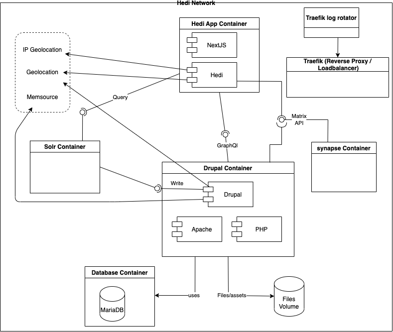
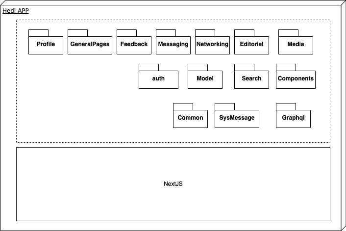
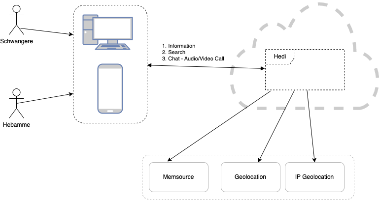

# hedi-public

This is the public repository of [Hedi](https://hedi.app), a platform that links pregnant women and young parents together with midwives, gynecologists, pediatricians and points of contact at social organizations. The main goal of Hedi is to help pregnant women find quick answers to their questions about pregnancy in their language and also to find a midwife who will help and accompany them during pregnancy and afterwards.

In addition to searching for midwives, users can connect and communicate with them via live chat or voice/video call.
## Architecture

Technically Hedi has multple loosely coupled modules. 

The main module [hedi-app](./hedi-app/) is based on the React meta-framework [Next.js](https://nextjs.org/). It contains all frontend components for the client as well as the api layer which is the interface to the (CMS-)backend / data layer.

The second repository is the [hedi-solr-module](./hedi-solr-utils/) which utilizes the [solr](https://solr.apache.org/) search server in order to query e.g. profiles based on parameters such as location or monthly capacity.

## App Modules

## Scope

